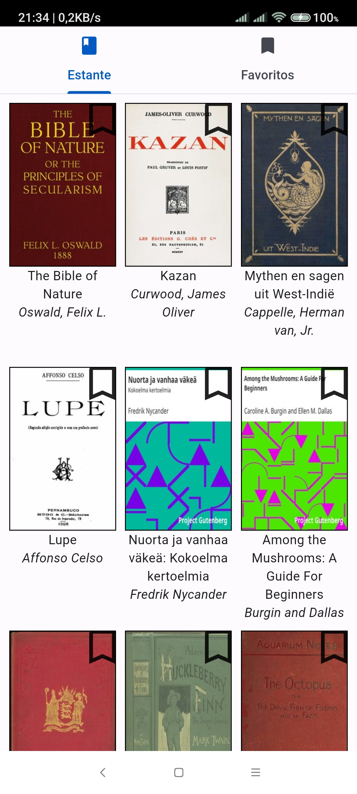

# README

## Ebook Reader

Este é um projeto Flutter para um leitor de e-books.

## Pré-requisitos

- Flutter SDK: Versão 2.0.0 ou superior.
- Dart: Versão 2.12.0 ou superior.
- Android Studio: Versão 4.1 ou superior (recomendado para desenvolvimento Android).

## Passos para executar o projeto

1. Clone o repositório:

```bash
git clone https://github.com/julianojstavares/ebook_reader.git
```

1. Navegue até a pasta do projeto:

```bash
cd ebook_reader
```

1. Obtenha as dependências do projeto:

```bash
flutter pub get
```

1. Execute o aplicativo:

Para Android:

```bash
flutter run
```

## Contribuição

Contribuições são bem-vindas. Sinta-se à vontade para abrir uma issue ou enviar um pull request.

## Licença

Este projeto está licenciado sob a licença MIT. Consulte o arquivo LICENSE para obter mais detalhes.

## Contato

Juliano Tavares - [https://linkedin.com/in/julianojstavares](LinkedIn)

## Agradecimentos

- A todos os contribuidores do projeto.
- A comunidade Flutter.


